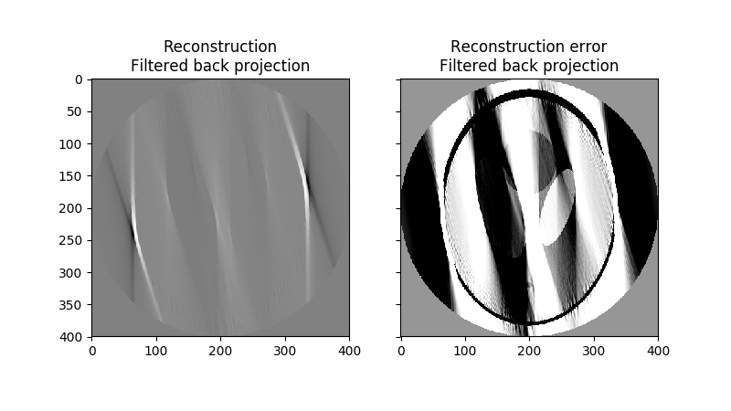

#Tıbbi Görüntüleme Sistemleri Dersi Dönem Projesi

Radon transformasyonu ile BT görüntüsünün oluşturulmasi.

# Kurulum

``` bash
mkdir project-dir
cd project-dir
virtualenv -p python3 ./kaynak
sourve kaynak/bin/activate
git clone https://github.com/tolgahanuzun/gericatim-radon
cd gericatim-radon
pip install -r requirements.txt
python radon.py
```
## 180 farklı açı


## 178 farklı açı


## 18 farklı açı



